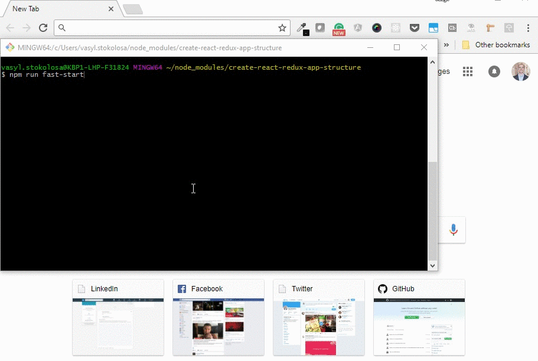

# Miami Bitcoin Hackathon 2020

## Stack
- [Express](https://expressjs.com/), Cors
- [React](https://reactjs.org/) + [Redux](https://redux.js.org/), ES6, async/await
- [Web Components](https://developer.mozilla.org/en-US/docs/Web/Web_Components/Using_custom_elements) (Custom Elements) integration
- React Router
- Internationalization
- SASS
- PostCSS (autoprefixer), so you do not need -webkit, -moz or other prefixes
- Build script configuration **Development, Staging, Production** with CDN, [cache-busting](https://www.keycdn.com/support/what-is-cache-busting/) support
- Build script to bundle JS, CSS, with sourcemaps
- Unit tests [Jest](https://jestjs.io/), [Enzyme](http://airbnb.io/enzyme/)
- E2E [Cypress](https://www.cypress.io/) tests
- [ESLint](https://eslint.org/)
- Ghooks (pre-commit with unit tests and eslint validation)
- Code Coverage (https://codecov.io)
- Travis CI runs Unit and E2E tests and report to codecov

## Quick Start ##
Create React + Redux app structure works on macOS, Windows, and Linux.
If something doesn’t work, please file an [issue](https://github.com/shystruk/create-react-redux-app-structure/issues/new).

#### npm
`npm i -g create-react-redux-app-structure`

#### yarn
`yarn add global create-react-redux-app-structure`

```
create-react-redux-app-structure my-app
cd my-app/
npm run fast-start
```
http://localhost:8080/ will be opened automatically.

When you are ready to deploy to staging/production please see [Build Scripts](#build-scripts) section.

## Getting Started ##
**You will need to have Node >= 6 on your local development machine and [Yarn](https://yarnpkg.com/en/docs/install#mac-stable) installed.**

Install it once globally:

#### npm
`npm i -g create-react-redux-app-structure`

#### yarn
`yarn add global create-react-redux-app-structure`

> Patience, please. It takes time, most of it is spent installing npm packages.

### Creating an App ###
To create a new app, run:
```
create-react-redux-app-structure my-app
cd my-app/
```
It will create a directory called my-app inside the current folder.

### Prepare config.json for build configurations ###
For running builds you need to have **config.json** in app/ folder.
So you can create new one or rename **app/config.json.example**.  

Inside that file:
 - **PATHS** is used in Grunt and Gulp tasks
 - **assetHost** CDN path for each build
 - **serverHost** is used for running e2e Cypress tests

### Installation ###
**`npm install`** or **`yarn install`**

>You can run **npm run fast-start** script, it will install all npm packages, run dev build, server and open http://localhost:8080/



### Run build script ###
Have a look at [Build Scripts](#build-scripts) section

### Run server ###
**`node index.js`** or **npm run server**

Then open http://localhost:8080/ to see test weather app :)

## Build scripts ##
Development - **`npm run dev`** or **`yarn run dev`**

Production - **`npm run prod`** or **`yarn run prod`**

Staging - **`npm run staging`** or **`yarn run staging`**


## Tests ##
Unit - **`npm run test`** or **`yarn run test`**

Unit with watch - **`npm run test:watch`** or **`yarn run test:watch`**

E2E - **`npm run e2e`** or **`yarn run e2e`**

## Team ##


## License

MIT © [Vasyl Stokolosa](https://about.me/shystruk)
